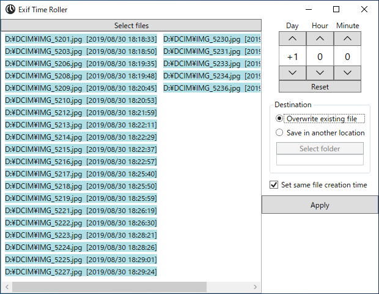

# Exif Time Shifter

A simple tool to shift date/time of JPG files by directly changing Exif date fields while leaving other data intact. It is quite useful when you wish to adjust __date taken__ of photos that were taken by a camera whose internal time was incorrectly set.

 
(DPI: 125%)

## Requirements

 * .NET Core 3.1 (Windows 10 October 2018 Update (1809) or newer)

## Download

:floppy_disk: <a href="https://github.com/emoacht/ExifDateEditor/releases/latest">Download</a>

## License

 - MIT License
